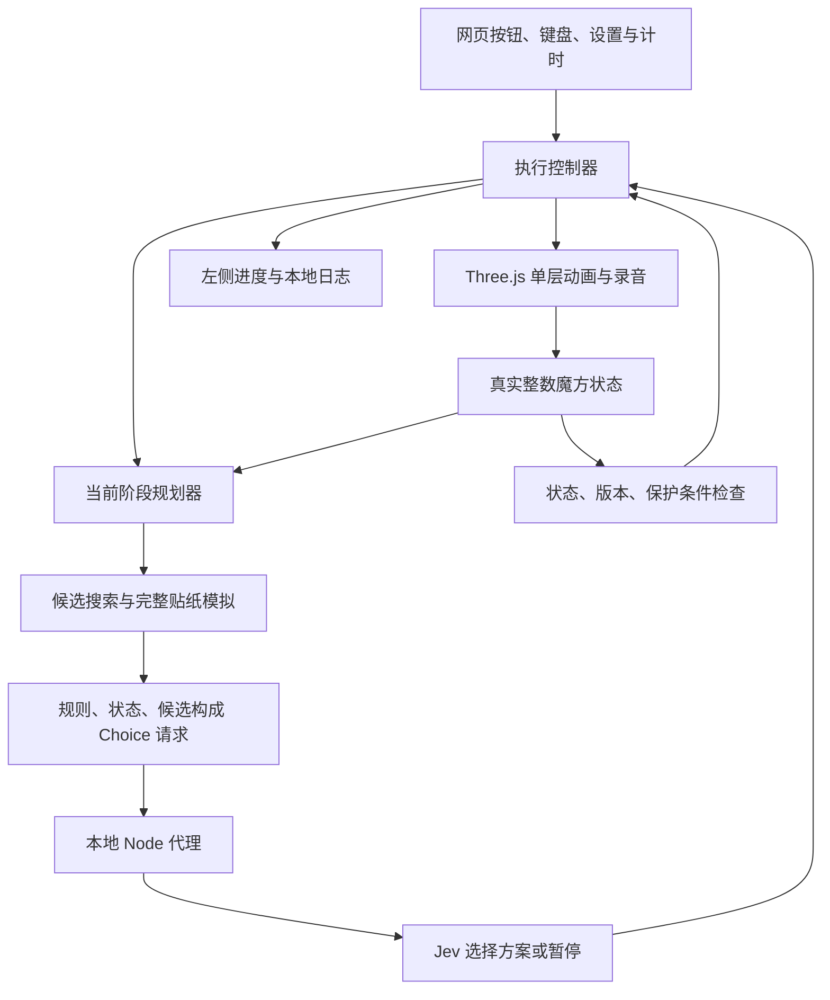
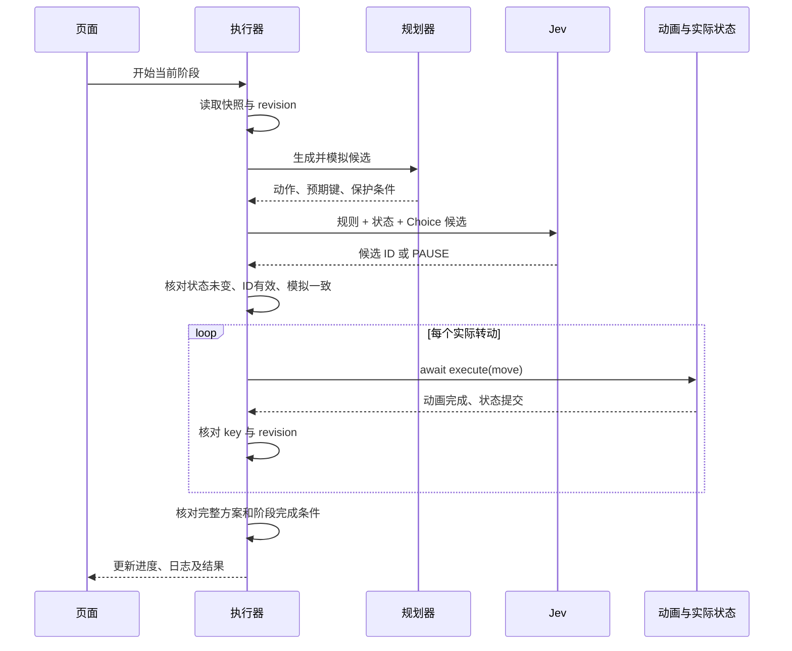

# Cube Lab：完整实现过程与技术原理

本文记录从网页版三阶魔方到 Jev 辅助七步复原的开发过程，并说明当前代码如何工作，供后续维护、复盘和扩展使用。

- 记录日期：2026-09-24。
- 代码基线：`455bfef`，即首次公开提交；本文是该基线之后的文档补充。
- 公开仓库：<https://github.com/ngocvychu38-web/cube-lab>。
- 依据：本次开发中的需求演进、实际修改和仓库源码。下文的迭代顺序来自开发过程，**不代表每次迭代都有独立 Git 提交**。
- 运行方式：Node.js 18+，执行 `node server.js`，访问 <http://127.0.0.1:8787/>。

## 1. 最终实现了什么

用户可以在浏览器中查看三维魔方、拖动观察视角，用按钮或键盘转动六个面，观看逐步打乱，并让 Jev 辅助完成七步复原。

当前主要功能：

1. Three.js 三维显示，真实外层转动动画。
2. 标准 `U D L R F B`、逆时针和半圈操作，以及撤销。
3. 20 步随机打乱，逐步播放、高亮当前动作并记录进度。
4. 七个阶段的独立操作和“一键完成七步”。
5. 将规则、真实贴纸状态、候选公式和预期结果传给 Jev。
6. 左侧实时显示阶段目标、候选、选中公式、转动步骤和操作记录。
7. 每次实际转动后核对模拟状态；最后检查六面共 54 张贴纸。
8. 真实魔方录音、试听、音效开关和本地保存。
9. AI 自动计时，停止或结束时暂停。
10. 保存魔方状态、AI 设置和日志，刷新后恢复可继续操作的状态。

这里的“AI 操作”采用以下分工：程序根据合法转动和阶段约束搜索候选，Jev 从候选中选择，执行器负责动画和检查。模型不能直接注入任意转动，完成判定也不依赖模型自述。

## 2. 开发过程

| 阶段 | 用户提出的问题或需求 | 实现方向与结果 |
| --- | --- | --- |
| 网页魔方 | 可以在线操作三阶魔方，并以 3D 展示 | 建立三维小块、彩色贴纸、观察视角、面转动和操作面板 |
| 视觉调整 | 背景过黑，与魔方黑色骨架难区分 | 使用较亮的灰蓝背景、分层面板和光照 |
| 接入 Jev | 增加 AI 操作、保存参数、记录操作 | 增加设置和调用入口；后续按 Jev 的 Choice 协议组织请求 |
| 接口配置 | 从参考文档确认模型地址，Key 由用户填写 | 使用固定上游地址，默认模型 `jev-latest`；Key 留在用户本地配置 |
| 请求故障 | 点击 AI 后出现 `Failed to fetch` | 增加本地 Node 代理与预检处理，统一从本地 HTTP 页面使用服务 |
| 可观察性 | 希望看到过程，设置不能遮住魔方 | 操作记录移至左侧，设置在侧栏展示并在保存后收起，动作逐步更新 |
| 转动一致性 | 看不到转动、打乱后出现黑块，以及记号不明确 | 以外层动画、整数位置、贴纸法向量和四元数同步维护状态，统一六面记号 |
| 决策规划 | 先讨论总体规则和上下文，再实施 | 明确阶段前提、完成条件、保护条件以及“模拟—选择—执行—检查”的流程 |
| 第 1 步 | 先把底层十字做好 | 独立状态模型、底棱搜索、Choice 候选、逐次核对、完成后停止 |
| 第 2 步 | 在十字基础上完成底层一面 | 增加角块公式搜索、十字保护和公式边界停止；保存魔方状态 |
| 第 3–5 步 | 中层棱块、顶层十字、顶面同色 | 增加中棱插入和顶层定向搜索；处理计数可能暂时下降的中间形态 |
| 第 6–7 步 | 完成顶角和顶棱排列 | 增加 T 换位、Ua/Ub 棱循环；最终核对六面贴纸和全部位置 |
| 音效第一版 | 扭动时播放机械声 | 使用 Web Audio 合成摩擦和咔嗒声，加入开关 |
| 音效替换 | 合成声不像真实魔方 | 搜索并采用 SpaceJoe 的 CC0 魔方实录，剪裁静音，增加试听入口 |
| 连续复原 | 一键把七步做完 | 增加跨阶段编排、跳过已完成阶段、统一停止和错误中断 |
| 自动计时 | AI 操作时自动开始计时 | 把计时绑定到任务忙碌状态，七步连续执行时不重置 |
| 实际打乱 | 重新打乱时显示真实动作 | 从瞬间改状态改为等待每个动画完成，记录实际已执行序列 |
| 发布代码 | 上传代码仓库并设置公开 | 建立公开 `cube-lab` 仓库，提交 `main`，保留音效许可说明 |

关于历史问题的边界：`Failed to fetch` 是浏览器给出的泛化错误，不能仅凭这句话认定唯一根因。代理、Origin 处理、超时和错误提示分别处理了常见失败环节。黑块问题也不在本文中归因于一个未经记录证实的唯一原因；现有实现通过同步位置与贴纸朝向、动画后核对状态来约束这类不一致。

## 3. 系统结构与文件分工



| 文件 | 职责 |
| --- | --- |
| [`index.html`](../index.html) | 页面样式、Three.js、输入控制、动画队列、状态序列化、AI UI、七步编排、音效、计时、打乱与存储 |
| [`cross-planner.js`](../cross-planner.js) | 无渲染的纯状态模型、标准转动、结构检查、状态键、第 1 步搜索与请求构造 |
| [`corner-planner.js`](../corner-planner.js) | 第 2 步的底角目标、公式、搜索、保护检查与上下文 |
| [`layer-planners.js`](../layer-planners.js) | 第 3–7 步的目标判定、公式集、投影搜索和最终六面检查 |
| [`cross-controller.js`](../cross-controller.js) | 七个阶段共享的执行器；文件名沿用第 1 步的命名 |
| [`server.js`](../server.js) | 静态文件、音频、本地 Jev 代理和健康状态 |
| [`cross.test.js`](../cross.test.js) | 第 1 步已有测试，包括纯转动、候选、模拟 Jev、取消和错误情形 |
| [`assets/audio/`](../assets/audio/) | 实录源文件、90°/180°播放片段和来源许可 |
| [`.gitignore`](../.gitignore) | 忽略环境文件、日志、依赖和临时抓取目录 |

项目使用浏览器脚本和 Node 内置模块，没有 npm 构建流程。Three.js 0.160.0 从 CDN 加载，因此三维引擎仍依赖网络；已下载的音效由本地服务提供。

## 4. 魔方状态如何表示

### 4.1 坐标、颜色和身份

固定坐标：`x` 向右，`y` 向上，`z` 向前。

| 面 | 中心颜色 | 法向量 | 正向转动的全局轴角 |
| --- | --- | --- | --- |
| U | 白 | `[0,1,0]` | 绕 y 轴 −90° |
| D | 黄 | `[0,-1,0]` | 绕 y 轴 +90° |
| R | 红 | `[1,0,0]` | 绕 x 轴 −90° |
| L | 橙 | `[-1,0,0]` | 绕 x 轴 +90° |
| F | 绿 | `[0,0,1]` | 绕 z 轴 −90° |
| B | 蓝 | `[0,0,-1]` | 绕 z 轴 +90° |

字母的顺时针定义以“正对该面”为准，不是以当前屏幕方向为准。撇号反转角度，`2` 表示半圈。拖动整个观察视角不会改变这些定义。

渲染器构建 27 个位置的三维小块，序列化时排除没有外部贴纸的中心内部块，得到 **26 个可见小块、54 张贴纸**。

每个小块的身份由原始贴纸面集合决定。例如黄绿红角块的身份为 `{D,F,R}`，无论它移动到哪里都不会改变。位置和贴纸法向量随转动更新。

下面是一个已归位黄绿棱块的状态示意，仅代表完整数组中的一个元素：

```json
{
  "position": [0, -1, 1],
  "stickers": [
    { "homeFace": "D", "color": "#ffd52a", "normal": [0, -1, 0] },
    { "homeFace": "F", "color": "#27c76f", "normal": [0, 0, 1] }
  ]
}
```

`homeFace` 是判断身份和目标的依据；`color` 用于呈现；`normal` 表示贴纸现在朝向哪里。

### 4.2 纯转动与状态键

`CrossPlanner.move(state, notation)` 复制输入，仅旋转指定层的小块及其全部贴纸法向量，不修改原数组。90°转动直接使用整数坐标置换，例如绕 x 轴正转：

```text
(x, y, z) → (x, −z, y)
```

`key(state)` 按小块身份和贴纸身份排序，序列化位置及朝向。数组顺序改变不会改变该键。执行器用它比较模拟结果和真实状态，也用它发现重复状态。

`validate(state)` 检查数量、坐标范围、位置重复、身份重复、外向贴纸、中心方向和各色九张等结构条件。它**不是完整的群论可达性验证器**，没有独立覆盖所有角扭、棱翻和排列奇偶约束。正常游戏状态由合法转动产生；未来如果允许导入任意状态，还需要补充可达性校验。

## 5. 3D 转动如何保持真实与可见

每个小块包含深色立方体骨架，只在该小块原本具有颜色的外表面创建贴纸。物理小块移动时，贴纸跟随小块旋转。

`animateVisualTurn()` 将动作放入队列，`nextTurn()` 每次只执行一个动作：

1. 解析面、轴、层和角度，选出对应层的九个小块。
2. 保存这九个小块当前的显示位置和四元数。
3. 用 `requestAnimationFrame` 更新旋转，缓动曲线为 `t²(3−2t)`。
4. 当前时刻用“本次旋转四元数 × 起始姿态”计算显示，避免逐帧累乘误差。
5. 最后一帧更新整数位置和法向量，将显示位置对齐整数位置，增加 `stateRevision`。
6. 更新界面、保存状态、完成本次 Promise，然后才执行下一个动作。

90°动画为 480 毫秒，180°为 650 毫秒。AI 执行器 `await` 每次动画，因此不会只更新文本却瞬间执行一整套公式。四元数用于连续显示，整数模型用于逻辑计算；每次 AI 转动完成后，两者所对应的实际状态必须与模拟一致。

观察视角由外层 `rig` 控制，与小块状态分离。相机随画布宽高调整距离；侧栏记录与设置不会覆盖三维画布。

## 6. 七步复原的统一判定

| 步骤 | 目标 | 完成条件 | 必须保护的前置结果 |
| --- | --- | --- | --- |
| 1 底层十字 | DF、DR、DB、DL | 位置正确，黄色朝下，侧色对齐 | 每套方案结束保留已有正确底棱 |
| 2 底层一面 | DFR、DRB、DBL、DLF | 四个底角位置、三色方向正确 | 十字及已有正确底角 |
| 3 中层棱块 | FR、RB、BL、LF | 中棱位置和两色方向正确 | 完整底层及已有正确中棱 |
| 4 顶层十字 | 四个带 U 色的顶棱 | 四张白色棱贴纸朝上 | 完整前两层 |
| 5 顶面同色 | 四个带 U 色的顶角 | 四个顶角白色朝上，合成白色顶面 | 前两层及顶层十字 |
| 6 顶层角块归位 | UFR、URB、UBL、ULF | 顶角位置正确且三个颜色分别对齐 | 前两层和白色顶面 |
| 7 顶层棱块归位 | UF、UR、UB、UL | 顶棱归位，并通过整个魔方检查 | 前两层、白色顶面及全部顶角 |

第 4、5 步只处理朝向，不要求顶层侧色顺序正确。第 6 步允许顶棱换位，第 7 步才完成它们。每个阶段只在其前提满足后开始。

### 6.1 第 1 步：底层十字的反向 BFS

一条棱有 12 个位置、2 种朝向，共 24 种局部状态。代码预计算这 24 种状态在 18 种合法动作下的转移。

对于一个待完成底棱，将“已经正确的底棱 + 本次目标棱”作为搜索子集，从它们全部正确的目标状态反向 BFS，建立距离表。随后从当前状态沿距离递减方向取出动作。

有 k 条被跟踪棱时，数组按 `24^k` 分配；四棱最多占用 331,776 个编码位置，其中并非每个组合都合法或可达。距离表按目标子集缓存在内存中，并定期让出事件循环，避免规划长时间阻塞界面。

得到路径后再用全部贴纸模拟，要求目标正确、已有正确底棱保留、完成数增加。每个动作包含半圈时按一次动作计数，因此这里的最短路径是该搜索子集和动作计价下的最短路径，不是整个魔方的全局最短解。

### 6.2 第 2 步：底角的加权公式搜索

一角有 8 个位置和 3 种黄色贴纸朝向，共 24 种局部状态。使用的基本动作组为：

```text
U / U' / U2
S U^n S' 或 S' U^n S，S ∈ {R, B, L, F}
```

这里的 `U^n` 对应代码中的 `U`、`U'`、`U2`。这些短公式用于取出、对位、插入角块。

先过滤会破坏已有正确底角的公式，再对目标角的 24 种状态做 Dijkstra 搜索。一个 U 对位动作费用为 1，一个三次转动的插入动作组费用为 3。该目标函数是减少实际执行的动作次数。

每个短公式结束都在完整状态上检查十字与已完成底角；整套候选结束还必须新增至少一个正确底角。目标角的投影搜索不能代替三色完整检查。

### 6.3 第 3 步：中棱取出与插入

典型公式：

```text
向右插入：U R U' R' U' F' U F
向左插入：U' L' U L U F U' F'
```

还包含逆公式、U 对位和四个侧向版本。改变侧向通过重新映射 F/R/B/L 字母实现，不改变全局坐标或真的转动整只魔方。

搜索状态以目标中棱的位置和一张指定贴纸的朝向表示；每个搜索节点仍携带完整魔方。只有保持底层以及已有正确中棱的公式结果才允许进入搜索。错误占槽或翻转的棱可以先取出再插入。

### 6.4 第 4、5 步：搜索整个定向目标

典型公式：

```text
顶棱定向：F R U R' U' F'
顶角定向：R U R' U R U2 R'
```

第 4 步按固定顶棱槽位观察白色朝向，第 5 步按固定顶角槽位观察白色朝向，暂时忽略小块身份排列。

重要区别是：定向过程中正确块数量可能不变或减少。程序不能要求每个基本公式都立即提升计数，而是搜索到四个目标全部定向正确，将这条完整路径作为一个候选交给 Jev。整个候选结束后才要求完成数增加。

候选可从无 U 对位、U、U'、U2 四种起点生成，并去重。搜索在完整公式边界检查前置阶段；当前通用搜索设置了 128 个已访问状态的上限，超出时暂停，而不是无限搜索。

### 6.5 第 6 步：顶角排列

使用 U 对位和 T 换位公式，以及侧向版本与逆公式：

```text
R U R' U' R' F R2 U' R' U' R U R' F'
```

状态投影记录四个固定顶角槽位里的小块身份，最多 24 种排列。目标是全部顶角位置及颜色正确。中间步骤允许原本正确的顶角移动，也允许顶棱换位，但每段结束必须保持前两层和白色顶面。

### 6.6 第 7 步：顶棱排列与最终检查

使用 Ua 三棱循环、其逆公式 Ub 和侧向版本：

```text
R U' R U R U R U' R' U' R2
```

不使用独立 U 对位，因为独立 U 会移动已经归位的顶角。通过选择公式的不同侧向版本改变被操作的棱。

状态投影记录四个固定顶棱槽位里的身份，编码最多 24 种排列；在合法前提下只会出现其中可达的子集。多次三循环可处理剩余排列。

最终 `wholeCubeStatus()` 同时检查：

- 六个面上各有九张贴纸，且它们的 `homeFace` 都对应该面。
- 贴纸总数 54，外部小块总数 26。
- 每个小块位置等于其原始各面法向量之和。
- 阶段前提和四个顶棱全部正确。

只有这些条件共同满足，才显示“整个魔方已复原”。六面各自的计数和总计 54/54 会进入最终操作日志。

## 7. 传给 Jev 的上下文与协议

配套阅读：[Jev 接口请求与返回示例](Jev接口请求与返回示例.md)。包含第 1、2、7 步的完整请求 JSON、解码上下文、返回示例，以及暂停和无效选择的处理。

### 7.1 可直接获取的信息

| 信息 | 来源 | 是否依赖截图或用户填写 |
| --- | --- | --- |
| 全部 26 块、54 张贴纸的位置和朝向 | `serializeCube()` | 否，直接从内部模型读取 |
| 当前阶段、目标块、正确数量 | 规划器 `status()` | 否 |
| 前置阶段是否完成 | 当前阶段的前提判定 | 否 |
| 固定面颜色、坐标和合法记号 | 代码中的规则常量 | 否 |
| 候选动作与完整模拟结果 | `plan()` 和纯转动模型 | 否 |
| 最近执行的方案 | 当前执行器内存 | 否，只保留请求所需的最近几轮 |
| 模型名与 API Key | 本地设置 | 由用户配置；Key 仅用于鉴权请求头 |

本项目没有让模型从截图猜测背面状态。实际请求携带全部贴纸，隐藏在视角背后的部分同样可用。

### 7.2 请求结构

上游地址：`https://api.typesafe.ai/v1/systemone`。默认模型：`jev-latest`。

使用原生 `state + questions.plan` Choice 结构。下面的伪代码说明构造方式，实际 `cube` 会携带全部小块：

```javascript
const payload = {
  model: configuredModel,
  state: JSON.stringify({
    rules: stageRules,
    stage: { number: stageNumber, name: stageName },
    revision: stateRevision,
    coordinates: coordinateDescription,
    progress: planner.status(snapshot),
    cube: snapshot,
    recentPlans: recent.slice(-4),
    candidates: plansWithoutExpectedKey
  }),
  questions: {
    plan: {
      type: 'choice',
      instructions: selectionInstructions,
      criteria: {
        /* 每个候选ID对应公式和预期进度描述 */
        PAUSE: '暂停，不代表完成'
      }
    }
  }
};
```

第 2–7 步还附带前置阶段信息，后续阶段的候选包含 `segments`、`safeStops`、保护范围等字段。`expectedKey` 留在执行器本地，不作为模型需要理解的上下文发送。

预期返回结构示意：

```json
{
  "answers": {
    "plan": {
      "type": "choice",
      "choice": "plan_1",
      "confidence": 0.9
    }
  }
}
```

不同阶段的候选 ID 前缀不同；执行器只接受本次候选中实际存在的 ID，或 `PAUSE`。`confidence` 可选，只展示和记录，不参与完成判定。代码没有使用 OpenAI 风格的 `messages` 聊天接口替代此协议。

最初由用户提供的接口参考入口是 <https://docs.qq.com/doc/DQnFjQVpmWmdiWGtC>。本文描述当前接入代码，不代表已重新核验在线服务文档的所有后续变化，也不代表真实账户鉴权已经验证。

## 8. 从候选到动作的执行保障



关键检查包括：

1. 请求前后比较快照键和 `stateRevision`，旧状态的回复不执行。
2. 模型返回不属于本轮候选的 ID 时拒绝执行。
3. 执行前再次从快照模拟整套公式，确认与候选保存的预期键相同。
4. 每次实际动作完成后，核对实际状态键和 `revision + 动作序号`。
5. 到达公式边界，检查前置阶段和保护的小块。
6. 整套公式结束，检查真实结果等于预期、完成数增加、已有成果得到保护。
7. 遇到重复状态、无候选、无效 JSON、接口错误、超时或不一致时暂停。

每个阶段设置最多四轮候选执行。第 1–3 步按每轮至少增加一个正确目标来约束进展；第 4–7 步的候选搜索到整个阶段完成，正常情况下选中一个完整候选即可结束该阶段。这里的“轮”是一套方案，不是一次 90°转动。

本地模拟使用独立于 Three.js 动画更新的纯转动函数，有助于发现两条实现路径之间的不一致。但它仍是软件检查，不等于经过形式化证明。

## 9. 单步、一键七步与停止机制

### 9.1 单阶段操作

`runAI()` 检查当前没有其他操作、阶段前提满足、必要设置存在，然后启动对应控制器。完成后选中下一阶段，等待用户再次点击。

### 9.2 一键完成七步

`runAllAI()` 使用固定的阶段顺序，读取当前实际状态，跳过已经完成的阶段。它一次保存调用配置，逐阶段等待控制器结果。

只有控制器返回 `status: 'complete'` 且实际阶段状态确实完成，才能进入下一阶段。`paused`、`stopped`、`error` 或非完成结果会结束连续操作。最后再调用第 7 步的完整检查。

`allRun` 让整个连续任务保持锁定，避免阶段之间短暂释放按钮后混入其他转动。`allStopRequested` 保证停止不仅作用于当前公式，也取消剩余阶段。已完全复原时不请求 Jev。

### 9.3 停止为什么不是随时切断动画

- 等待网络或规划时可以取消请求或规划。
- 第 1 步等待当前完整层转动结束，再停止。
- 第 2–7 步按照候选的 `safeStops` 停在完整公式边界。

例如停止发生在插入公式中途，立即截断可能让前置十字或底层暂时被破坏。因此执行器会完成当前公式、恢复前置阶段后再停止。第 6 步可能等待一个 14 次动作的 T 公式，第 7 步可能等待一个 11 次动作的棱循环。

这项等待只适用于用户取消。实际状态与模拟不一致时，程序会立即中止后续动作，不会假装仍能保证保护条件。

## 10. 打乱、音效和计时

### 10.1 逐步打乱

生成 20 个合法动作，相邻动作不使用同一个面；后缀从无撇号、撇号、2 中选取。它是随机合法序列，不承诺是官方比赛规范的均匀随机状态生成器。

开始时清空本轮复原转动历史、将计时归零并锁定其他转动入口。对每个动作执行：

```javascript
高亮当前动作并显示序号;
await applyMove(notation, false, true);
scrambleMoves.push(notation);
保存实际状态;
记录该动作已经完成;
```

`scramblePlanned` 用来显示完整计划，`scrambleMoves` 只记录实际完成的部分。打乱动作不加入后续用户“撤销”使用的复原历史，但会出现在操作日志中。

当前打乱没有独立的取消按钮，正常播放完成后解锁；若刷新中断，会恢复最近保存的实际状态，不会自动补完未执行动作。

### 10.2 从合成声改为真实录音

第一版使用 Web Audio 的噪声滤波、振荡器与包络模拟摩擦和卡位。用户反馈不像真实魔方，因此替换为实录：

- 作品：**Rubik Cube Turn - 10**。
- 作者：SpaceJoe。
- 来源：<https://freesound.org/people/SpaceJoe/sounds/486562/>。
- 许可：CC0 1.0。
- 原始公开预览约 1.161 秒，保存在 `rubik-turn-source.mp3`。

加工时取约 0.37–0.89 秒的转动段，去掉首尾静音，增加 2 dB 并做极短淡入淡出。用 FFmpeg `atempo` 保持音高进行时长处理：90°版本匹配约 480 毫秒，180°版本拼接两段较短转动匹配约 650 毫秒。详细来源见 [`CREDITS.md`](../assets/audio/CREDITS.md)。

浏览器按需获取两个 WAV，缓存解码后的 AudioBuffer。点击或按键时解锁 AudioContext，随后按动画开始时间播放；若加载产生延迟，按已过去的时间偏移起播。动画结束时淡出剩余音频。没有再叠加合成敲击声。

试听按钮独立于魔方状态，不会转动魔方；关闭音效或隐藏页面时压低主音量。音频加载失败会让游戏继续运行，试听会提示重试。

### 10.3 AI 自动计时

计时依据 `performance.now()`，不是把帧数乘以假定帧长。

当任务由空闲变为忙碌且确实有未完成目标时，自动开始或继续计时；从忙碌恢复空闲时暂停。计时包含规划、等待 Jev、网络和动画时间，不是纯转动耗时。

连续七步通过 `allRun` 保持同一次忙碌区间，所以阶段切换不清零、不暂停。停止、暂停或错误会冻结累计时间，再次操作接着累计。重新打乱、复原按钮或手动计时重置会归零。

AI 和打乱期间禁用手动计时控制，避免任务时间被中途改写。当前计时数值没有写入本地存储，刷新后会重新归零；“保存魔方进度”不包含计时恢复。

## 11. 状态保存与日志

| localStorage 键 | 内容 | 恢复行为 |
| --- | --- | --- |
| `cubeLab.aiConfig.v1` | 模型、Key、目标及接口配置字段 | 恢复模型和 Key；入口阶段按实际状态重新选择，接口固定为当前代码地址 |
| `cubeLab.aiLog.v1` | 最近最多 400 条事件 | 展示在侧栏，可导出 JSON |
| `cubeLab.cube.v1` | 完整魔方、复原动作、已执行打乱动作、视角、版本 | 恢复逻辑状态和三维显示，选择最早未完成阶段 |
| `cubeLab.sound.v1` | 音效开关 | 恢复开关 |

`restoreCube()` 校验状态，再按小块身份匹配渲染对象。对于有两张以上贴纸的小块，使用两条原始法向量与它们的叉积构建原始基底；再用当前法向量构建目标基底，两者得到旋转矩阵和四元数。中心块用单法向量旋转恢复。

刷新不恢复运行中的请求、公式队列或搜索缓存。如果在公式中途刷新，实际状态可能暂时不满足先前完成阶段；程序会从当前最早未完成的一步恢复，不能假定刷新前选中的阶段仍可直接执行。

日志包括候选、选择、每次动作、保护检查、阶段结束、一键任务及打乱事件。日志在内存中维护，写存储失败不会阻止后续动作。错误信息中若出现当前 Key，会替换为隐藏标记。超过 400 条的旧日志会被截断，因此导出文件不保证包含无限期完整历史。

## 12. 本地代理与运行边界

浏览器调用本地 `/api/jev`，Node 转发到固定上游地址。使用 `file://` 页面时，代码改用 `http://127.0.0.1:8787/api/jev`，但推荐直接使用本地 HTTP 页面。

当前服务：

- 仅绑定 `127.0.0.1`，默认端口 8787，可用 `PORT` 修改服务端端口。
- 限制 Host 为本机名称及端口，接受本机页面来源和 `null` Origin。
- 处理 API 的 OPTIONS 预检以及所需请求头。
- 请求要求 Bearer 鉴权头和有效 JSON，正文上限 256 KB。
- 使用 UTF-8 接收正文，避免中文上下文分块时损坏。
- 上游超时 55 秒，浏览器控制器超时 60 秒；客户端断开时尝试取消上游。
- 静态资源按明确列表提供，不直接暴露任意工作区文件。
- Key 不写入服务端文件；由浏览器请求头传递给上游。

API Key 当前存放在浏览器 localStorage，并不是加密凭据库。代码公开仓库中没有用户 Key。这个服务是本地单用户工具，不等同于具备账号隔离、速率限制、部署 HTTPS 等能力的公共托管服务。

`file://`、`localhost`、`127.0.0.1` 的存储来源可能不同。切换地址时可能看不到原来的设置。若修改端口并继续使用文件页面，还需同步修改代码中固定的文件模式地址。

## 13. 发布记录

首次公开发布包含源码、已有测试、README、实录源文件、加工后的 WAV 和音效许可说明。

- 仓库：`ngocvychu38-web/cube-lab`。
- 可见性：公开。
- 分支：`main`。
- 首次提交：`455bfefa5c24c2f913fcbbaf4a41a3e28ec7b840`。
- 发布前添加 `.gitignore` 并扫描常见凭据模式，扫描未发现匹配项。
- 首次 HTTPS 推送遇到连接中断，改用 HTTP/1.1 重试成功；随后确认公开属性和远端提交与本地一致。

凭据模式扫描不等于完整安全审计。公开 GitHub 仓库也不等于已经发布在线网站；当前网页仍由本机服务运行，GitHub Pages 不能直接运行这个 Node 代理。

## 14. 做过哪些检查，哪些还没有

| 范围 | 实际记录 | 结论边界 |
| --- | --- | --- |
| 第 1 步单元与执行流程 | 当时的 8 项测试通过，含 60 组固定种子的 25 步打乱 | 覆盖的是当时版本；共享执行器随后有修改，不能当作最新七步整体通过 |
| 第 1 步浏览器流程 | 使用模拟 Jev 回复跑到十字 4/4，检查了显示和真实状态对应 | 没有使用真实 Jev 账户完成该次验证 |
| 第 2–7 步及后续功能 | 进行了 JavaScript 语法检查，页面更新后入口可见 | 语法和页面可见不等于完整求解、停止与恢复的端到端通过 |
| 音频素材 | 确认来源许可，读取时长和静音区间，使用 FFmpeg 加工并接入 | 不代表已完成用户设备上的主观音质、响度和同步验收 |
| 仓库发布 | GitHub 返回公开状态，远端与本地提交哈希一致 | 证明代码已上传，不证明运行逻辑正确 |
| 真实 Jev 调用 | 后续实现阶段未由助手进行真实 Jev 端到端调用 | 实际鉴权、额度、网络和服务行为需运行时确认 |

本次文档整理没有新增或执行测试。已有测试文件可用 `node --test cross.test.js` 运行；用户要求验证时，建议按下面的范围补齐：

1. 随机合法状态经过七步全部达到 54/54，每步保护条件成立。
2. 顶层定向计数下降、角换位、棱双交换等非单调情形。
3. 每个公式中途停止、跨阶段停止、刷新后恢复。
4. 真实 Jev Choice 请求、非法返回、超时、鉴权失败和主动暂停。
5. 打乱期间重复点击、键盘输入、计时归零和实际序列记录。
6. 音效首次解锁、加载失败、静音、后台页面与动画同步。

这些是待验证范围，不是已完成的测试结果。

## 15. 维护与扩展建议

维护新阶段或修改算法时，优先保持以下接口和约束：

```text
validate(state)                  检查基础结构
ready(state)                     检查本阶段前提（可选）
status(state)                    返回目标、计数、前提和完成状态
plan(state, { signal })          返回已在完整状态上模拟的候选
request(state, plans, context)   构造 Jev Choice 请求
move(state, notation)            返回纯模拟的新状态
key(state)                      返回稳定状态键
```

后续可以把页面中的三维渲染、音效、存储和七步编排拆成独立模块，便于分别验证。当前 `index.html` 仍集中承载这些职责，且保留了一些早期七步描述函数；运行时发送给 Jev 的阶段规则应以各规划器的 `request()` 为准。

若增加新公式，应同时定义它在什么边界恢复哪些前置条件，并让完整贴纸模拟验证该条件。若改用新的模型服务，应保持“只接受本轮候选、版本一致、逐次核对”的执行约束。若要支持导入任意魔方、公共部署或完全离线运行，需要分别补足可达性检查、服务部署能力和本地三维引擎资源。

整个实现的核心经验是：把状态获取、可执行动作、阶段目标和完成证明做成明确的程序约束，再让模型参与有边界的选择。这样日志可以解释决策，动画可以体现动作，程序可以核对结果。
